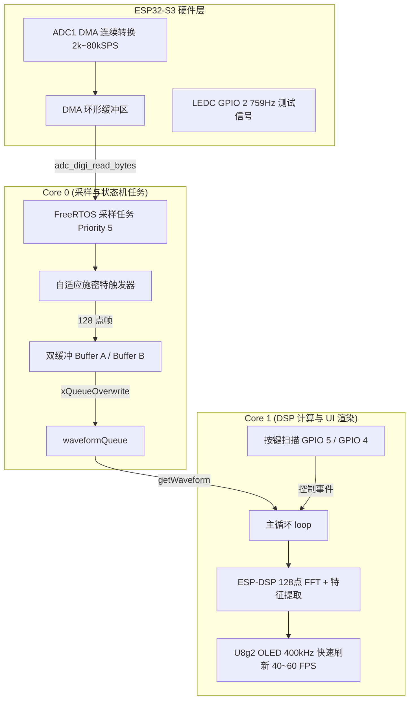

# ESP32-S3 FreeRTOS Mini Oscilloscope (DMA + DSP 高性能示波器) 📈

基于 **ESP32-S3** 与 **FreeRTOS** 实现的高性能双核数字示波器。本项目升级为 **ESP-IDF ADC DMA 连续硬件采样** 与 **ESP-DSP 硬件加速 FFT 频域分析**，支持多档时基采样率切换、RUN/STOP 冻结及波形/频谱双模式显示。

---

## ✨ 核心特性

- **⚡ ADC DMA 连续硬件采样**：
  - 基于 ESP-IDF 原生 ADC DMA 驱动，彻底摆脱定时器 CPU 中断开销与采样抖动；
  - 支持多档采样率动态切换（**2 kSPS ~ 80 kSPS**），适应不同频段信号。
- **🔄 FreeRTOS 双缓冲与多核解耦 (Ping-Pong Buffer)**：
  - Core 0 独立后台任务高速搬运并解析 DMA 流；
  - Core 1 主循环负责高精度 DSP 计算与 OLED 400kHz 极速渲染（**40~60 FPS**）。
- **📊 ESP-DSP 硬件加速 FFT 频域分析**：
  - 利用 ESP32-S3 Xtensa DSP 指令集进行 128 点加窗（Hann Window）Radix-2 复数快速傅里叶变换；
  - 动态绘制 64 柱频谱条形图，自动锁定基波与主要谐波 Peak 频率。
- **🎯 动态自适应施密特触发器**：
  - 自动根据信号中点与幅值调整触发阈值与迟滞宽度，彻底解决小信号与直流偏置信号跳波问题。
- **🎮 按键交互与 RUN/STOP 冻结**：
  - **GPIO 5 (外部按键)**：短按切换 **RUN / STOP** 冻结波形；长按（持续按住达 600ms 即刻触发）切换 **时域波形 <-> FFT 频谱模式**；
  - **GPIO 4 (外部按键)**：短按循环切换 **多档时基采样率**。
- **📐 丰富参数测量**：
  - 频率 $F$、周期 $T$、占空比 $\text{Duty}$、最大电压 $V_{\max}$、最小电压 $V_{\min}$、峰峰值 $V_{\text{pp}}$、直流分量 $V_{\text{avg}}$、真有效值 $V_{\text{rms}}$。
- **🧪 内置测试信号源**：利用 ESP32-S3 LEDC 硬件外设在 `GPIO 2` 生成 759Hz 信号，方便免外部设备直接自测闭环。

---

## 🛠️ 硬件与引脚分配 (Pinout)

| 引脚功能 | ESP32-S3 引脚 | 说明 |
| :--- | :--- | :--- |
| **ADC 采样输入** | `GPIO 1` (ADC1_CH0) | 模拟信号输入通道（0 ~ 3.3V） |
| **测试信号输出** | `GPIO 2` | 内置 759Hz 硬件信号（短接 GPIO 1 即可自测） |
| **RUN/STOP / 模式切换** | `GPIO 5` | 外部按键（内部上拉）：短按 RUN/STOP，长按即刻切换 FFT |
| **时基切换按键** | `GPIO 4` | 外部按键（内部上拉）：切换采样率档位 |
| **OLED SDA** | `GPIO 9` | I2C 数据线（400kHz 高速） |
| **OLED SCL** | `GPIO 8` | I2C 时钟线 |

---

## 🏗️ 系统架构图

---

## 🚀 操作说明

1. **短按外部按键 (GPIO 5)**：切换 `RUN`（实时运行）与 `STOP`（画面冻结，方便观察单帧细节）；
2. **长按外部按键 (GPIO 5 持续按住 >= 600ms)**：无需松手，达到时长**即刻**在 **时域波形模式** 与 **FFT 频谱柱状图模式** 之间一键切换；
3. **按下 GPIO 4 按键**：循环切换采样率时基：
   - `80kSPS` -> `40kSPS` -> `20kSPS` -> `10kSPS` -> `5kSPS` -> `2kSPS`。

