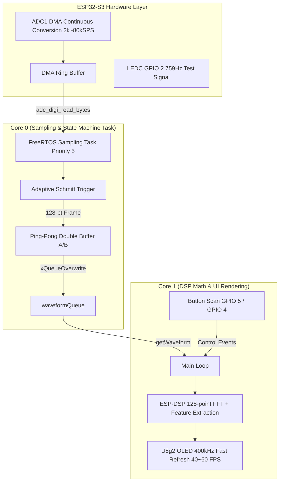

# ESP32-S3 FreeRTOS Mini Oscilloscope (DMA + DSP High Performance) 📈

<p align="center">
  <a href="README_EN.md"></a>
  <a href="README.md"></a>
  <a href="https://www.espressif.com/en/products/socs/esp32-s3"></a>
  <a href="https://www.freertos.org/"></a>
  <a href="https://platformio.org/"></a>
  <a href="LICENSE"></a>
</p>

A high-performance dual-core digital oscilloscope implemented on **ESP32-S3** and **FreeRTOS**. Powered by **ESP-IDF ADC DMA continuous hardware sampling** and **ESP-DSP hardware-accelerated FFT frequency domain analysis**, supporting multi-level timebase sampling rate switching, RUN/STOP freeze, and dual-mode waveform/spectrum visualization.

---

## ✨ Key Features

- **⚡ ADC DMA Continuous Hardware Sampling**:
  - Leverages native ESP-IDF ADC DMA driver to eliminate CPU timer interrupt overhead and sampling jitter.
  - Supports dynamic switching between multiple sampling rates (**2 kSPS ~ 80 kSPS**) to accommodate signals across frequencies.
- **🔄 FreeRTOS Dual-Buffer & Multi-Core Decoupling (Ping-Pong Buffer)**:
  - **Core 0**: High-speed dedicated background task streams and parses DMA buffers.
  - **Core 1**: Main execution loop handles precision DSP computation and 400kHz high-speed OLED rendering (**40~60 FPS**).
- **📊 ESP-DSP Hardware-Accelerated FFT Analysis**:
  - Utilizes ESP32-S3 Xtensa DSP instruction set for 128-point Hann-windowed Radix-2 complex FFT computation.
  - Dynamically renders 64-column spectrum bar chart and automatically tracks fundamental & major harmonic peak frequencies.
- **🎯 Dynamic Adaptive Schmitt Trigger**:
  - Automatically adjusts trigger threshold and hysteresis band according to signal midpoint and amplitude, preventing waveform jitter on weak or DC-biased signals.
- **🎮 Tactile Controls & RUN/STOP Freeze**:
  - **GPIO 5 (External Button)**: Short press toggles **RUN / STOP** frame freeze; Long press (>= 600ms hold) instantly switches between **Time-Domain Waveform <-> FFT Spectrum** mode.
  - **GPIO 4 (External Button)**: Short press cycles through **timebase sampling rate gears**.
- **📐 Comprehensive Telemetry Measurements**:
  - Frequency $F$, Period $T$, Duty cycle $\text{Duty}$, Max voltage $V_{\max}$, Min voltage $V_{\min}$, Peak-to-peak $V_{\text{pp}}$, DC average $V_{\text{avg}}$, and True RMS $V_{\text{rms}}$.
- **🧪 Built-in Test Signal Generator**:
  - Generates a 759Hz hardware test square wave on `GPIO 2` via ESP32-S3 LEDC peripheral, enabling immediate loopback testing by jumping GPIO 2 to GPIO 1.

---

## 🛠️ Hardware & Pinout

| Pin Function | ESP32-S3 Pin | Description |
| :--- | :--- | :--- |
| **ADC Sampling Input** | `GPIO 1` (ADC1_CH0) | Analog signal input channel (0 ~ 3.3V) |
| **Test Signal Output** | `GPIO 2` | Built-in 759Hz hardware test signal (bridge to GPIO 1 for loopback) |
| **RUN/STOP & Mode Toggle** | `GPIO 5` | External tactile button (internal pull-up): Short press RUN/STOP, long press FFT |
| **Timebase Gear Button** | `GPIO 4` | External tactile button (internal pull-up): Cycle sampling rates |
| **OLED SDA** | `GPIO 9` | I2C Data line (400kHz Fast Mode) |
| **OLED SCL** | `GPIO 8` | I2C Clock line |

---

## 🏗️ System Architecture



---

## 🚀 Operation Guide

1. **Short press GPIO 5**: Toggle between `RUN` (real-time stream) and `STOP` (frame freeze for detailed inspection).
2. **Long press GPIO 5 (hold >= 600ms)**: Instantly switch between **Time-Domain Waveform Mode** and **FFT Spectrum Bar Chart Mode**.
3. **Press GPIO 4**: Cycle through sampling rate timebase presets:
   - `80kSPS` -> `40kSPS` -> `20kSPS` -> `10kSPS` -> `5kSPS` -> `2kSPS`.

---

## 💻 Quick Build & Flash (PlatformIO)

This project is built using standard [PlatformIO](https://platformio.org/):

1. **Environment**: Recommended using VS Code with the **PlatformIO IDE** extension.
2. **Clone the repository**:
   ```bash
   git clone https://github.com/krantjohn/esp32-freertos-oscilloscope.git
   cd esp32-freertos-oscilloscope
   ```
3. **Compile and flash firmware**:
   ```bash
   # Build and upload to ESP32-S3
   pio run -t upload

   # Open serial monitor
   pio device monitor
   ```

---

## 📄 License

This project is licensed under the [MIT License](LICENSE).
